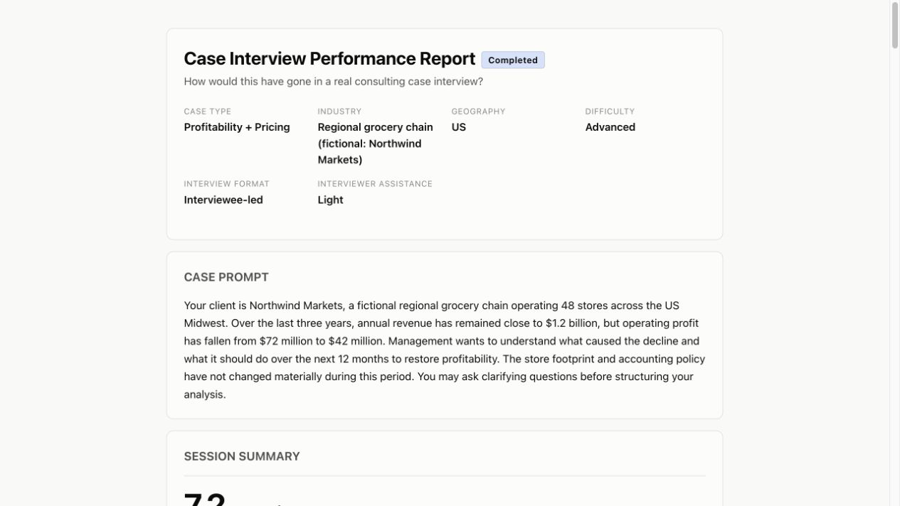
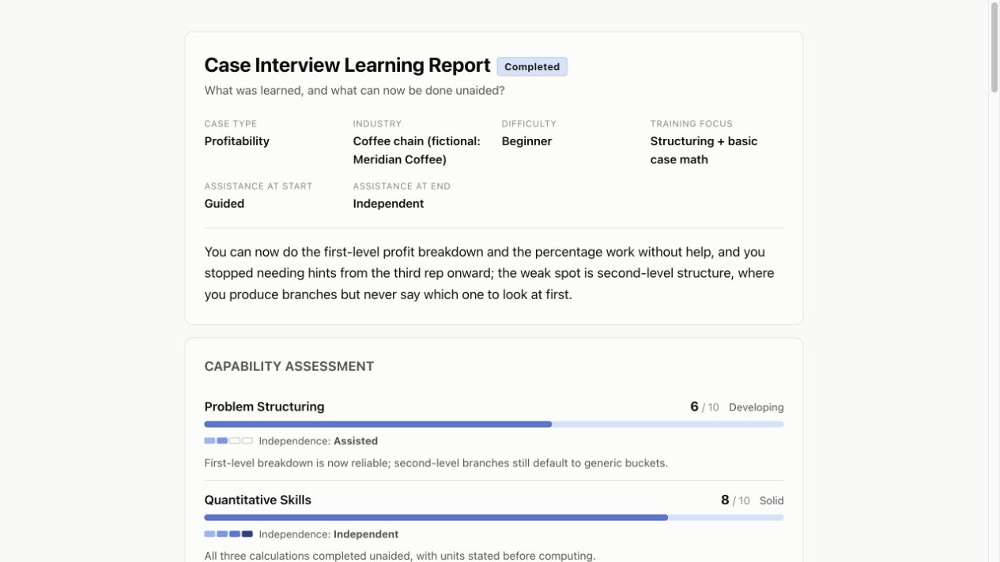
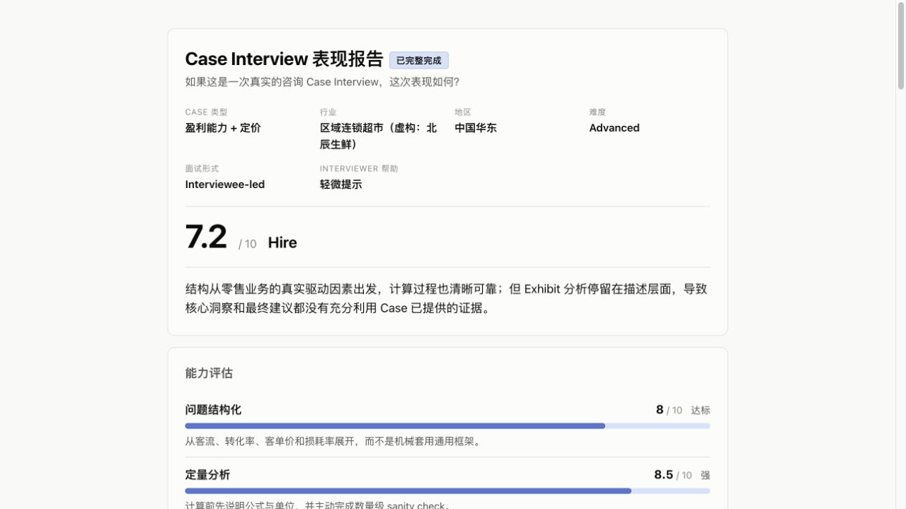
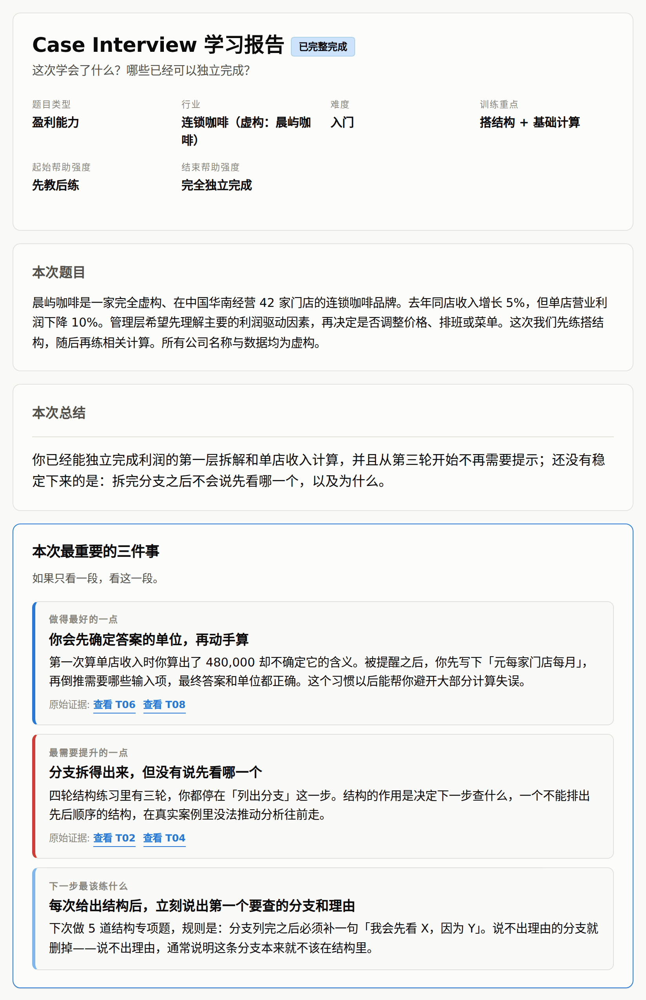

# Case Interview Coach

A Claude Code skill designed for high-fidelity consulting case interview mocks. It builds a
coherent case before the session, behaves like a controlled interviewer during it, and produces
an evidence-linked HTML debrief afterward. Tutorial support is available when you want coaching
instead of assessment.

**[English](#english) · [中文](#中文)**

---

# English

## What it does

A general-purpose LLM can give you a business problem. Case Interview Coach is designed to run the
whole case experience: structured case generation, controlled information release, realistic
interviewer behaviour, case math and exhibits, synthesis, and a report grounded in what you
actually said.

The core product is the mock interview and its debrief. Two training modes let you use the same
case system either for independent assessment or guided learning.

## Report preview

Every completed session can produce a self-contained HTML report with the original Case Prompt,
capability diagnosis, critical moments, missed insights, a complete natural-language transcript,
links from analysis back to the relevant turns, and next training priorities. Reports work
offline and contain no external scripts or tracking.

### Interview report



[View the full Interview report example](examples/generated/interview-report.html) — GitHub may
show its source; download it and open it locally for the rendered report.

### Tutorial report



[View the full Tutorial report example](examples/generated/tutorial-report.html) — GitHub may
show its source; download it and open it locally for the rendered report.

## Key capabilities

- **Realistic mock interviews.** Run an original or user-supplied case in interviewer-led or
  interviewee-led format, with information disclosed in response to the candidate's questions.
  Formal mocks cover structuring, quant, exhibits, brainstorming and synthesis without teaching
  the answer during the interview.
- **Structured case generation.** Cases are designed from a complete internal blueprint—client
  objective, root cause, hidden facts, quant modules and exhibits—then checked for numerical and
  logical consistency. Structures and economics are adapted to the industry rather than pulled
  from a generic framework list.
- **Evidence-based debriefs.** Reports connect capability assessments and critical moments to the
  original Case Prompt and exact transcript turns, then show missed insights, a stronger approach
  and what to practise next.
- **Tutorial support.** Beginners can learn the same methodology through explanation, hints,
  retries and focused drills, with assisted and independent performance kept distinct.

Learn more about [case generation](references/case-generation.md), the shared
[case methodology](references/case-methodology.md), the
[evaluation rubric](references/evaluation-rubric.md), and the
[report system](references/report-system.md).

## Interview vs Tutorial

These are two ways to use the same case-interview system:

| | Interview Mode | Tutorial Mode |
|---|---|---|
| Purpose | Realistic formal mock | Guided learning or focused practice |
| During the case | No teaching feedback; minimal realistic interviewer help | Explanations, hints, diagnosis and retries as needed |
| Review | Independent performance and interview-readiness diagnosis | Mastery, independence, hint dependence and next training plan |

The mode remains fixed for a session so assisted and unassisted performance are not presented as
equivalent. Detailed boundaries and session behaviour live in
[`SKILL.md`](SKILL.md), [Interview Mode](references/interview-mode.md), and
[Tutorial Mode](references/tutorial-mode.md).

## Installation

Tested on **Claude Code**. Clone the repository into your skills directory:

```bash
git clone https://github.com/ShuchangZhang/case-interview-coach.git \
  ~/.claude/skills/case-interview-coach
```

Start a new Claude Code session or reload skills in the current one. Skills are read at session
start, so an existing session may not see a newly cloned skill.

## Quick start

Ask in plain language, in English or Chinese:

```text
Run an advanced profitability case as an interviewee-led formal mock.

Give me a consulting case interview in Interview Mode.

I'm new to case interviews—teach me from scratch.

Tutorial Mode: five market-sizing drills.

Here's a casebook PDF—run case 3 as an interview.
```

If your request does not make the training mode clear, the skill asks before the case starts.

## Requirements and verification

- **Host:** Claude Code is the tested and supported environment. Other hosts with compatible
  skills and local-script support may work, but are not claimed as supported.
- **Python:** 3.8 or newer as `python3`; no third-party packages.
- **Optional memory:** Cross-session learner profiles require host-provided project-memory tools.
  Without them, cases, sessions, evaluation and current-session reports still work.

Verify the renderer with the bundled fictional examples:

```bash
cd ~/.claude/skills/case-interview-coach
python3 scripts/build_report.py examples/interview-report.json -o interview-report.html
python3 scripts/build_report.py examples/tutorial-report.json  -o tutorial-report.html
```

## How it works

1. The skill settles the training goal and loads only the relevant methodology and mode guidance.
2. For a generated case, it builds and consistency-checks a blueprint before revealing the prompt.
3. It runs the session with controlled information release, then converts a validated session
   record into one local HTML report.

The implementation is intentionally split between the router in [`SKILL.md`](SKILL.md), focused
files in [`references/`](references/), and the local
[`build_report.py`](scripts/build_report.py) renderer. See
[design and validation notes](docs/design-and-validation-notes.md) for architecture history rather
than duplicating it here.

## Testing

```bash
python3 -m unittest discover -s tests -v
```

The standard-library test suite runs in CI on Python 3.8 and 3.12. It covers both report modes,
schema and guard-rail validation, HTML escaping, transcript evidence links, self-contained output,
invalid-input failures and working-directory independence.

## Privacy and data

The renderer runs locally and makes no network requests. Generated reports include the complete
user-visible natural-language conversation from the training session, including anything you
typed, plus assessments and learning progress. Review the HTML before sharing it publicly.

Conversation storage and model processing are governed by the host application. Cross-session
progress is available only when the host supplies project-memory tools.

## Methodology and sources

The methodology draws on public recruiting material from McKinsey, BCG and Bain, selected case
preparation resources, and the architecture of firm-published sample cases. No case content is
reproduced. The complete URLs, access dates and source-to-method mapping are in
[`references/research-notes.md`](references/research-notes.md).

**Not affiliated with or endorsed by McKinsey, BCG, Bain, or any other firm.**

## Known limitations

- Claude Code is the only tested host environment.
- Cross-session progress depends on host-provided memory capabilities.
- Generated cases and assessments remain LLM-driven; blueprint and renderer checks reduce, but do
  not eliminate, inconsistency or judgment errors.
- The scoring system is a training instrument, not any firm's internal hiring bar, and the skill
  does not replace feedback from an experienced human interviewer.

## License

[MIT](LICENSE). Applies to the entire repository.

---

# 中文

## 这是什么

这是一个面向 Consulting Case Interview 的高真实度 AI Mocking Skill。它会在 Session 前建立完整且
一致的 Case，过程中像面试官一样控制信息披露，结束后再根据你真正说过的内容生成有证据链接的 HTML
复盘报告。

核心产品是完整的 Case Mock 与深度复盘；Interview Mode 和 Tutorial Mode 是同一套 Case 系统针对
独立测评和引导学习提供的两种训练方式。

## 报告预览

每次完成 Session 后都可以生成一份自包含 HTML 报告，包括原始 Case Prompt、能力诊断、关键节点、
遗漏洞察、完整自然语言 Transcript、从分析跳回原始回答的 evidence link，以及下一步训练重点。报告
可以离线打开，不包含外部脚本或追踪代码。

### Interview 报告



[查看完整中文 Interview 示例报告](examples/generated/interview-report.zh-CN.html)——GitHub 可能显示
HTML 源码；下载后在本地浏览器打开即可查看完整报告。

### Tutorial 报告



[查看完整中文 Tutorial 示例报告](examples/generated/tutorial-report.zh-CN.html)——GitHub 可能显示
HTML 源码；下载后在本地浏览器打开即可查看完整报告。

## 核心能力

- **真实 Case Mock。** 支持原创或用户提供的 Case、interviewer-led 与 interviewee-led 形式，并根据
  Candidate 的问题释放相应信息。正式 Mock 覆盖 structuring、quant、exhibit、brainstorming 和
  synthesis，过程中不进行教学式答案提示。
- **结构化 Case Generation。** 先建立包含客户目标、root cause、hidden facts、quant modules 和
  exhibits 的完整 blueprint，再检查数字与逻辑一致性。Case 结构和商业逻辑会根据行业 economics
  调整，而不是套用通用框架列表。
- **有证据的深度复盘。** 报告把能力诊断和关键节点链接到原始 Case Prompt 与具体 Transcript turn，
  并给出遗漏洞察、更强的分析路径和下一步训练重点。
- **Tutorial 支持。** 初学者可以通过讲解、提示、重试和专项练习学习同一套方法论；报告会区分有辅助
  与独立完成的表现。

深入了解：[Case generation](references/case-generation.md)、
[Case methodology](references/case-methodology.md)、
[Evaluation rubric](references/evaluation-rubric.md) 和
[Report system](references/report-system.md)。

## Interview 与 Tutorial

它们是使用同一套 Case Interview 系统的两种方式：

| | Interview Mode | Tutorial Mode |
|---|---|---|
| 目的 | 高真实度正式 Mock | 引导学习或专项训练 |
| Case 过程中 | 不给教学反馈，只提供最低限度的真实 interviewer 帮助 | 按需要提供讲解、提示、诊断和重试 |
| 复盘重点 | 独立表现和面试准备度诊断 | 掌握程度、独立程度、提示依赖和下一阶段计划 |

Mode 在一次 Session 中保持固定，避免把有辅助和无辅助的表现解释成同一件事。详细边界和 Session
行为请查看 [`SKILL.md`](SKILL.md)、[Interview Mode](references/interview-mode.md) 和
[Tutorial Mode](references/tutorial-mode.md)。

## 安装

本项目在 **Claude Code** 上开发和测试。Clone 到 skills 目录：

```bash
git clone https://github.com/ShuchangZhang/case-interview-coach.git \
  ~/.claude/skills/case-interview-coach
```

启动一个新的 Claude Code Session，或重新加载当前 Session 的 skills。Skills 在 Session 启动时读取，
已经运行的 Session 可能无法识别刚刚 Clone 的 Skill。

## 快速开始

直接用中文或英文描述你的训练目标：

```text
给我做一次正式 Mock，interviewee-led，advanced profitability case。

来一场 Consulting Case Interview，使用 Interview Mode。

我完全没接触过 Case Interview，请从头教我。

Tutorial Mode，只练 Market Sizing，五道。

我上传一份 Casebook PDF，请把第 3 题当作正式面试来跑。
```

如果你的请求没有明确训练方式，Skill 会在 Case 开始前询问。

## 环境要求与安装验证

- **宿主环境：** Claude Code 是唯一经过测试和正式支持的环境。其他支持兼容 Skill 格式和本地脚本的
  宿主可能可用，但不在已验证范围内。
- **Python：** 3.8 或更高，命令为 `python3`；不需要第三方依赖。
- **可选记忆：** 跨 Session learner profile 依赖宿主提供的 project-memory 工具。没有这些工具时，
  Case、Session、测评和本次报告仍然正常工作。

使用仓库自带的虚构示例验证 renderer：

```bash
cd ~/.claude/skills/case-interview-coach
python3 scripts/build_report.py examples/interview-report.json -o interview-report.html
python3 scripts/build_report.py examples/tutorial-report.json  -o tutorial-report.html
```

## 工作原理

1. Skill 确定训练目标，只加载本次需要的方法论和 Mode 指南。
2. 对于生成型 Case，先建立并检查完整 blueprint，再向 Candidate 释放题目。
3. Session 中控制信息披露；结束后把通过验证的 Session 记录转换成一份本地 HTML 报告。

实现被刻意拆分为 [`SKILL.md`](SKILL.md) 中的路由、[`references/`](references/) 中按需读取的指南，
以及本地 [`build_report.py`](scripts/build_report.py) renderer。架构演进和验证历史见
[Design and validation notes](docs/design-and-validation-notes.md)，README 不再重复维护这些细节。

## 测试

```bash
python3 -m unittest discover -s tests -v
```

测试套件只使用 Python 标准库，CI 覆盖 Python 3.8 和 3.12。测试范围包括两种报告、schema 与
guard-rail validation、HTML escaping、Transcript evidence link、自包含输出、非法输入失败，以及
不依赖当前工作目录运行。

## 隐私与数据

Renderer 在本地运行，不发起网络请求。生成的报告包含本次训练中全部用户可见的自然语言对话，包括
你自行输入的内容，以及能力评价和学习进度。公开上传或分享 HTML 前请先检查内容。

对话的保存与模型处理由宿主应用的数据政策决定。只有宿主提供 project-memory 工具时，Skill 才能
维护跨 Session 进度。

## 方法论与来源

方法论参考 McKinsey、BCG、Bain 的公开招聘材料、选定的 Case 备考资源，以及咨询公司公开 sample
case 的架构。不复制任何 Case 内容。完整 URL、访问日期和方法论映射见
[`references/research-notes.md`](references/research-notes.md)。

**本项目与 McKinsey、BCG、Bain 或任何其他咨询公司均无关联，也未获得其背书。**

## 已知限制

- 目前只在 Claude Code 上完成测试。
- 跨 Session 进度取决于宿主是否提供 memory 能力。
- 生成型 Case 和测评仍由 LLM 驱动；blueprint 与 renderer 检查可以降低、但不能消除逻辑不一致或
  判断偏差。
- 评分是训练工具，不代表任何公司的内部招聘标准，也不能替代有经验的真人 Interviewer 的反馈。

## 许可证

[MIT](LICENSE)，适用于整个仓库。
